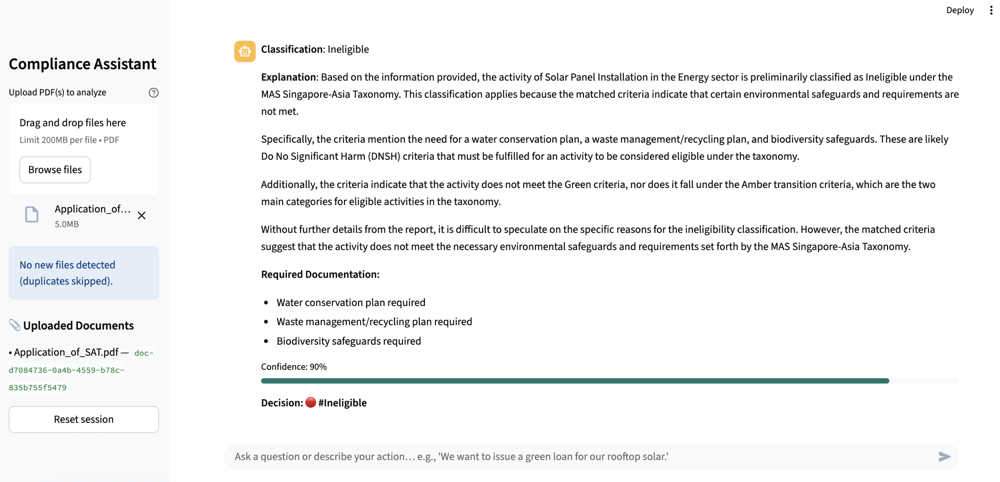

# MASense-ai-agent

Agentic AI system leveraging **MAS Singapore-Asia Taxonomy**, MAS APIs, and **AWS Bedrock**  
to assess financial activity compliance with sustainability taxonomy.  

It combines:
- **FastAPI** backend (evaluation pipeline + RAG retrieval + classification logic)  
- **Streamlit** frontend (interactive compliance assistant UI)  
- **Chroma / FAISS** vector store for document retrieval  
- **LangGraph Agent** (agentic orchestration of RAG pipeline, applying taxonomy rules)  
- **Airflow DAGs** for orchestration of ingestion workflows  


## Getting Started

### 1. Clone the repository
```bash
git clone https://github.com/<your-org>/MASense-ai-agent.git
cd MASense-ai-agent
```

### 2. Create a virtual environment and install the requirements:
```bash
python3 -m venv .venv && source .venv/bin/activate
pip install -r requirements.txt
```

### 3. Run the FastAPI backend:
```bash
uvicorn app.api:app --host 0.0.0.0 --port 8000 --reload
```

### 4. Run the Streamlit frontend:
```bash
# In a separate terminal
cd ui
streamlit run app.py --server.port 8501
```


## Workflow
The MASense-ai-agent workflow evaluates financial activities against MAS Sustainability Taxonomy principles. It uses a **Retrieval-Augmented Generation (RAG)** pipeline orchestrated by a **LangGraph Agent**.  

### **System Flow**
1. **User Input**  
   - Users upload sustainability reports (PDF) or enter plain-English activity descriptions.  
   - Files are stored locally (or in S3 at scale) for ingestion.  

2. **Batch Ingestion (Airflow)**  
   - `Storage → Airflow → Parse & Chunk → Embed → Vector DB`  
   - Sustainability reports are parsed into text chunks, embedded, and stored in **Chroma / FAISS** vector DB.  
   - This creates a reusable knowledge base for RAG queries.  

3. **Online Query (RAG Loop)**  
   - `Streamlit → FastAPI → LangGraph Agent ↔ Vector DB → LangGraph Agent → FastAPI → Streamlit`  
   - The **LangGraph Agent** retrieves taxonomy-relevant clauses from the Vector DB.  
   - Retrieved context is injected into the evaluation pipeline to ground responses.  

4. **Evaluation Pipeline (Agentic Orchestration)**  
   - Nodes in the LangGraph Agent handle:  
     - Clause retrieval  
     - Rule application (taxonomy alignment)  
     - Drafting classification & explanations  
     - Generating final structured outputs  

5. **Classification and Explanation**  
   - Activities are classified (`Green`, `Amber`, `Ineligible`) per MAS Taxonomy.  
   - Detailed explanations include matched criteria, missing documentation, and rationale.  

6. **Results Display**  
   - Streamlit frontend shows classification, explanation, and follow-ups.  
   - Users can refine queries interactively or upload more documents.  


## Orchestration with Airflow

MASense-ai-agent uses **Airflow DAGs** to orchestrate ingestion and ensure reproducibility.

### `mas_pipeline.py` DAG
1. **Document Parsing**: Extracts text from uploaded PDFs into JSON chunks.  
2. **Vector Indexing**: Builds/updates embeddings in Chroma / FAISS.  
3. **Clause Retrieval**: Prepares relevant taxonomy references.  
4. **Rule Application**: Applies MAS Taxonomy rules.  
5. **Explanation Drafting**: Generates detailed classification explanations.  
6. **Result Storage**: Saves results for traceability.  

> **Note:** Airflow handles **offline ingestion**. The **LangGraph Agent** handles **real-time query-time RAG**.


## Project Structure
```bash
MASense-ai-agent/
├── app/                     # FastAPI backend
│   ├── api.py               # API endpoints (chat, evaluate, session)
│   ├── graph.py             # LangGraph orchestration pipeline
│   ├── bedrock_client.py    # AWS Bedrock client wrapper
│   ├── nodes/               # Workflow nodes
│   │   ├── apply_rules.py
│   │   ├── retrieve_clauses.py
│   │   ├── draft_explanation.py
│   │   └── ...
│   └── utils/               # Shared utilities
│
├── data/                    # Uploaded & processed documents
│   ├── uploads/             # Session-based PDF uploads
│   ├── parsed/              # JSON-parsed text chunks
│   └── chroma/              # Chroma vector store persistence
│
├── tasks/                   # DAGs and pipelines (Airflow-compatible)
│   └── mas_pipeline.py
│
├── ui/                      # Streamlit frontend
│   ├── app.py               # Main Streamlit entrypoint
│   ├── components/          # UI sections
│   │   ├── chat_sections.py
│   │   ├── input_form.py
│   │   └── results_display.py
│   └── utils/               # Shared UI utils
│
├── configs/                 # Config files (rulesets, taxonomy JSONs)
├── requirements.txt
├── setup.py
├── README.md
└── .gitignore
```


## Demo Usage

1. **Upload Sustainability Report (PDF)**  
   Example: `Application_of_SAT.pdf`  
   - Parsed and indexed into Vector DB.  

2. **Ask Questions in Plain English**  
   Example prompts:  
   - `"Scan the uploaded report and summarise taxonomy-relevant activities."`  
   - `"We plan to finance a 50MW solar PV project in Singapore. Classify and explain."`  
   - `"Evaluate if our gas plant retrofit with 90% CCS could be Green or Transitional."`  

3. **View Results**  
   - **Classification**: `Green / Amber / Ineligible`  
   - **Explanation**: Clause references, matched criteria, missing documentation.  


## Key Concepts

- **LangGraph Agent**: Orchestrates workflow, retrieves taxonomy rules, applies logic, drafts explanations.  
- **RAG**: Combines user input with retrieved clauses from the Vector DB to generate grounded, compliant outputs.  
- **Vector DB (Chroma / FAISS)**: Stores document embeddings for efficient similarity search.  
- **Airflow DAGs**: Automates ingestion of sustainability reports into the vector DB.  


## Example Output

