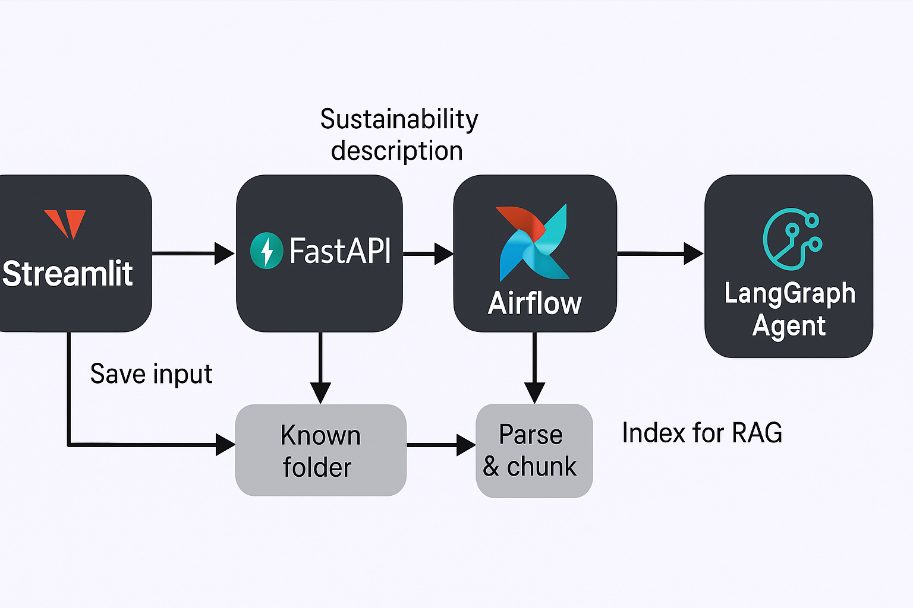

# MASense-ai-agent

Agentic AI system leveraging **MAS Singapore-Asia Taxonomy**, MAS APIs, and **Groq / AWS Bedrock**  
to assess financial activity compliance with sustainability taxonomy.  

It combines:
- **FastAPI** backend (evaluation pipeline + RAG retrieval + classification logic)  
- **Streamlit** frontend (interactive compliance assistant UI)  
- **Chroma / FAISS** vector store for document retrieval  
- **Airflow DAGs** for orchestration of workflows  

## Getting Started

### 1. Clone the repository
```bash
git clone https://github.com/<your-org>/MASense-ai-agent.git
cd MASense-ai-agent
```

### 2. Create a virtual environment and install the requirements:
```bash
python3 -m venv .venv && source .venv/bin/activate
pip install -r requirements.txt
```

### 3. Run the FastAPI backend:
```bash
uvicorn app.api:app --host 0.0.0.0 --port 8000 --reload
```

### 4. Run the Streamlit frontend:
```bash
# In a separate terminal
cd ui
streamlit run app.py --server.port 8501
```

### Workflow
---


The MASense-ai-agent workflow is designed to evaluate financial activities against the MAS Sustainability Taxonomy principles. Here's how the system operates:

1. **Document Upload**:
   - Users upload sustainability reports or other relevant documents (PDF format).
   - The system parses the documents into text chunks and builds a vector index using Chroma or FAISS.

2. **Question Input**:
   - Users input questions or descriptions of financial activities in plain English.
   - Example: `"We plan to finance a 50MW solar PV project in Singapore. Classify and explain"`

3. **RAG Retrieval**:
   - The system retrieves relevant clauses and rules from the MAS Sustainability Taxonomy using a Retrieval-Augmented Generation (RAG) approach.
   - This ensures that the evaluation is based on the most relevant taxonomy principles.

4. **Evaluation Pipeline**:
   - The FastAPI backend processes the input using LangGraph orchestration.
   - Nodes in the pipeline handle tasks such as applying rules, drafting explanations, and generating classifications.

5. **Classification and Explanation**:
   - The system classifies the activity as `Green`, `Amber`, or `Ineligible`.
   - It provides a detailed explanation, including matched criteria and required documentation.

6. **Results Display**:
   - The Streamlit frontend displays the classification, explanation, and any missing documentation.
   - Users can interact with the assistant to refine their queries or upload additional documents.

---

### Orchestration with Airflow

MASense-ai-agent uses **Airflow DAGs** to orchestrate complex workflows for document processing and evaluation. The DAGs ensure that tasks are executed in the correct order and handle dependencies between steps.

#### `mas_pipeline.py`

1. **Document Parsing**:
   - Extracts text from uploaded PDFs and stores parsed chunks in the vector store.

2. **Vector Indexing**:
   - Builds or updates the vector index using Chroma or FAISS.

3. **Clause Retrieval**:
   - Retrieves relevant clauses from the MAS Sustainability Taxonomy based on the user's query.

4. **Rule Application**:
   - Applies taxonomy rules to classify the activity and identify matched criteria.

5. **Explanation Drafting**:
   - Generates a detailed explanation of the classification, including required documentation.

6. **Result Storage**:
   - Stores the classification, explanation, and artifacts for future reference.

The DAGs are designed to be modular, allowing easy integration with additional workflows or external systems.

---

### Project Structure
```bash
MASense-ai-agent/
├── app/                     # FastAPI backend
│   ├── api.py               # API endpoints (chat, evaluate, session)
│   ├── graph.py             # LangGraph orchestration pipeline
│   ├── bedrock_client.py    # AWS Bedrock client wrapper
│   ├── nodes/               # Individual workflow nodes
│   │   ├── apply_rules.py
│   │   ├── retrieve_clauses.py
│   │   ├── draft_explanation.py
│   │   └── ...
│   └── utils/               # Shared utilities
│       ├── api_client.py
│       ├── rules_catalog.py
│       └── session_state.py
│
├── data/                    # Uploaded & processed documents
│   ├── uploads/             # Session-based PDF uploads
│   ├── parsed/              # JSON-parsed text chunks
│   └── chroma/              # Chroma vector store persistence
│
├── tasks/                   # DAGs and pipelines (Airflow-compatible)
│   └── mas_pipeline.py
│
├── ui/                      # Streamlit frontend
│   ├── app.py               # Main Streamlit entrypoint
│   ├── components/          # UI sections
│   │   ├── chat_sections.py
│   │   ├── input_form.py
│   │   └── results_display.py
│   └── utils/               # Shared UI utils
│
├── configs/                 # Config files (rulesets, taxonomy JSONs)
│
├── requirements.txt
├── setup.py
├── README.md
└── .gitignore
```

---

### Demo Usage
1. Upload a Sustainability Report (PDF)
    * Example: `Application_of_SAT.pdf`
    * THe system extracts text and builds a vector index (Chroma / FAISS).
2. Ask Questions in Plain English
    Example prompts:
        * `"Scan the uploaded report and summarise our taxonomy-relevant activities."`
        * `"We plan to finance a 50MW solar PV project in Singapore. Classify and explain"`
        * `"Evaluate if our gas plant retrofit with 90% CCS could be Green or Translation."`
3. View Results
    * Classification (`Green / Amber / Ineligible`)
    * Explanation (with taxonomy clause references)
    * Required documentation still missing

Example Output:
